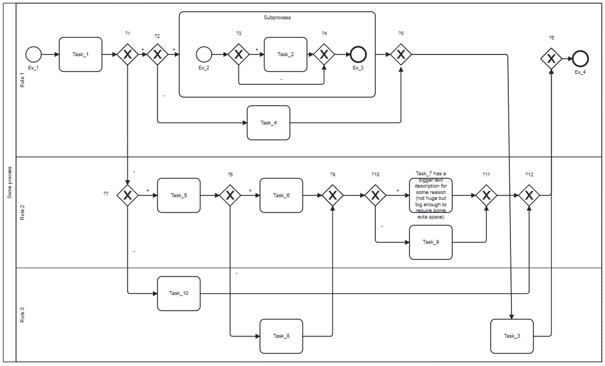

(!) Скрипт в разработке, пока что ничего не работает, описание ниже - 
целевая схема.

## Как это будет работать

- делаем диаграму в своем любимом редакторе, получаем схему, например такую

- скачиваем скрипт
- выгружаем схему в формате .bpmn из своего любимого редактора
- копируем в буфер xml содержимое из .bpmn файла
- запускаем скрипт
- в открывшемся окне вставляем текст и нажимаем на кнопку "Convert"
- в соседнем поле появится текст, копируем его и заменяем в файле
- загружаем файл обратно в редактор

## Ограничения

Большая часть ограничений будет снята по мере развития проекта, а пока:

- каждый процесс или субпроцесс должен начинаться со стартового события
  (или нескольких стартовых событий)
- артефакты рендерятся в общем потоке
- не поддерживаются граничные события
- не поддерживается автораскладка взаимодействий
- на схеме один процесс
- размеры элементов не пересчитываются

